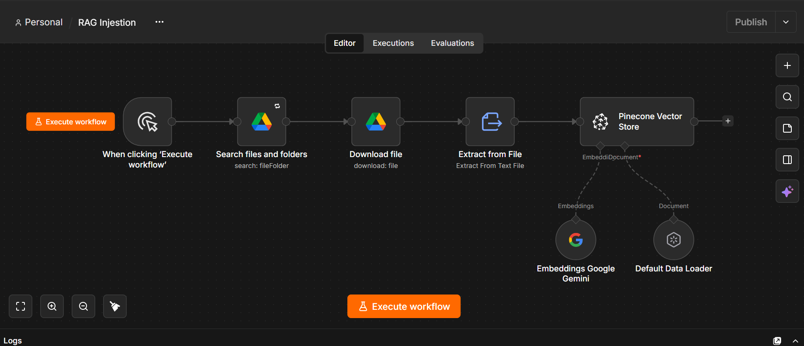

# RAG Ingestion (n8n)

An n8n workflow that reads documents from a Google Drive folder, converts them to text, creates embeddings with Google Gemini, and stores them in a Pinecone vector index. This is the ingestion half of a RAG (Retrieval-Augmented Generation) setup: once your documents are in Pinecone, an AI agent can search them to answer questions.

## Workflow preview

## How it works

| Step | Node | Purpose |
|---|---|---|
| 1 | Manual Trigger | Starts the workflow when you click Execute |
| 2 | Search files and folders | Lists every file inside a chosen Google Drive folder |
| 3 | Download file | Downloads each file (Google Docs are converted to plain text) |
| 4 | Extract from File | Pulls the text out of the downloaded file |
| 5 | Default Data Loader | Prepares the text as documents |
| 6 | Embeddings Google Gemini | Converts the text into vector embeddings |
| 7 | Pinecone Vector Store | Inserts the embeddings into your Pinecone index |

## Requirements

- An [n8n](https://n8n.io) instance (cloud or self-hosted)
- A Google account connected to n8n via OAuth (Google Drive)
- A Google Gemini API key
- A [Pinecone](https://www.pinecone.io) account with an index created

## Setup

1. In n8n, create a new workflow and choose **Import from File**, then select `workflow.json`.
2. Reconnect your credentials on these nodes:
   - **Search files and folders** and **Download file**: Google Drive OAuth
   - **Embeddings Google Gemini**: Google Gemini API key
   - **Pinecone Vector Store**: Pinecone API key
3. In **Search files and folders**, replace `YOUR_GOOGLE_DRIVE_FOLDER_ID` with the ID of your folder. You can find it at the end of the folder's URL in Google Drive.
4. In **Pinecone Vector Store**, select your own index.
5. Click **Execute workflow**. Your documents will be embedded and stored in Pinecone.

## Notes

- The index dimension in Pinecone must match the embedding model's output size.
- Running the workflow again will insert the documents again, which can create duplicates in the index.
- Credentials are not included in the export. Do not commit API keys to this repository.

## Files

- `workflow.json`: the exportable n8n workflow
- `README.md`: this file
